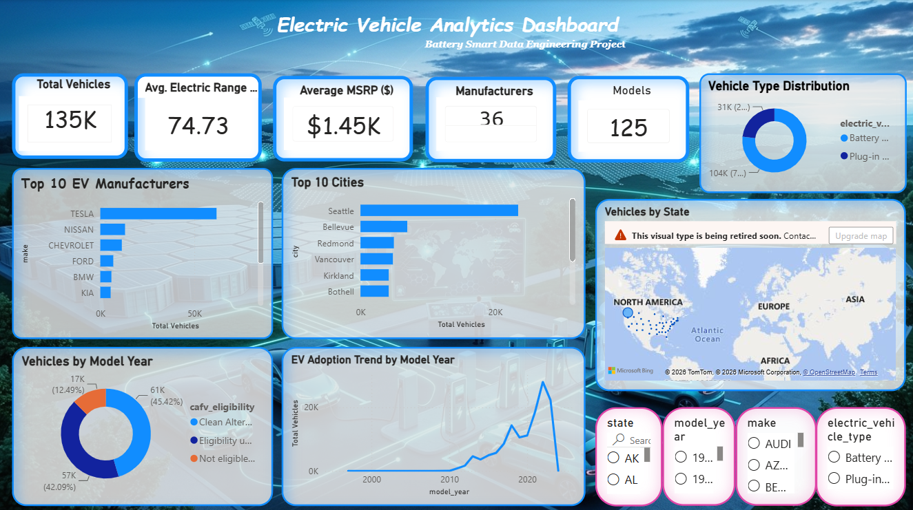

# ⚡ Battery Smart EV Analytics Platform

> End-to-End Data Engineering, SQL Analytics, Power BI Dashboard & Machine Learning Project using Electric Vehicle Population Data.


---

# 📷 Dashboard Preview



This interactive Power BI dashboard provides insights into Electric Vehicle adoption, manufacturer performance, CAFV eligibility, vehicle types, electric range, and state-wise distribution.

---

# 📌 Project Overview

This project demonstrates a complete end-to-end Data Engineering and Analytics workflow using Electric Vehicle (EV) population data.

The objective is to build an ETL pipeline that extracts raw EV data, transforms and cleans it, loads it into a MySQL database, and generates interactive Power BI dashboards to derive business insights.

The project is further extended with Machine Learning to predict EV characteristics and provide intelligent analytics.

---

## ✨ Project Highlights

- 📊 Built an end-to-end ETL pipeline using Python and Pandas.
- 🗄️ Loaded cleaned data into MySQL for structured storage and querying.
- 📈 Designed an interactive Power BI dashboard with dynamic KPIs and visualizations.
- 🔍 Performed SQL-based business analysis to uncover EV market trends.
- 📁 Maintained a well-structured GitHub repository with complete project documentation.
- 🚀 Planned extension with Machine Learning and Streamlit for predictive analytics.

---

## 🏗️ Project Architecture

```text
                   Electric Vehicle Population Data (CSV)
                                      │
                                      ▼
                          Python ETL Pipeline (Pandas)
                                      │
                                      ▼
                     Data Cleaning & Transformation
                                      │
                                      ▼
                           Processed CSV Dataset
                                      │
                                      ▼
                              MySQL Database
                                      │
                                      ▼
                         SQL Business Analysis
                                      │
                                      ▼
                    Interactive Power BI Dashboard
                                      │
                                      ▼
               🤖 Machine Learning (Under Development 🚧)
```

---

# 📂 Project Structure

```text
BatterySmart-DataEngineering/
│
├── dashboard/
│   └── EV_Dashboard.pbix
│
├── screenshots/
│   └── dashboard_home.png
│
├── data/
│   ├── raw/
│   │   └── Electric_Vehicle_Population_Data.csv
│   │
│   └── processed/
│       └── ev_data_cleaned.csv
│
├── database/
│   └── battery_smart_db.sql
│
├── docs/
│   ├── 01_database_setup.sql
│   ├── 02_data_validation.sql
│   └── 03_business_analysis.sql
│
├── scripts/
│   ├── extract.py
│   ├── transform.py
│   └── main.py
│
├── README.md
├── requirements.txt
├── LICENSE
└── .gitignore
```

---

## 📂 Dataset Information

| Attribute | Details |
|-----------|---------|
| Dataset | Electric Vehicle Population Data |
| Records | 134,779 |
| Features | 17 Columns |
| Data Format | CSV |
| Source | Kaggle (Electric Vehicle Population Data), originally from Washington State Department of Licensing |
| Processing | Python (Pandas) |
| Storage | MySQL |
| Visualization | Power BI |

---

## 📊 Project Statistics

- 📁 Dataset Size: 134,779 Records
- 📑 Features: 17 Columns
- 🏢 Manufacturers: 36
- 🚗 Models: 125
- 📊 Dashboard Visuals: 10+
- 🗄️ SQL Queries: 15+

---

## ⚙️ Tech Stack

| Category | Technologies |
|-----------|--------------|
| Programming | Python |
| Data Processing | Pandas, NumPy |
| Database | MySQL |
| Query Language | SQL |
| Business Intelligence | Power BI, DAX |
| Version Control | Git, GitHub |
| Machine Learning | Scikit-learn (Under Development) |
| Future Enhancement | Streamlit |

---

## 🌟 Project Features

- End-to-End ETL Pipeline
- Automated Data Cleaning & Transformation
- MySQL Database Integration
- Business SQL Queries
- Interactive Power BI Dashboard
- Dynamic KPI Cards
- Interactive Filters & Slicers
- Business Intelligence Reporting
- Git Version Control
- Well-Documented Repository

---

# 🔄 ETL Pipeline

### Extract

- Read raw CSV
- Validate dataset

### Transform

- Remove missing values
- Clean column names
- Convert data types
- Handle duplicates

### Load

- Export cleaned dataset
- Import into MySQL

---

# 📈 Power BI Dashboard

The dashboard includes:

- Total Vehicles
- Average Electric Range
- Average MSRP
- Total Manufacturers
- Total Models
- Top EV Manufacturers
- Vehicle Distribution by State
- Vehicle Type Analysis
- CAFV Eligibility Analysis
- Interactive Filters

---

## 📌 Dashboard KPIs

| KPI | Value |
|------|------:|
| Total Vehicles | 134.8K |
| Average Electric Range | 74.73 Miles |
| Average MSRP | $1.45K |
| Total Manufacturers | 36 |
| Total Models | 125 |

---

## 📊 Dashboard Visuals

The dashboard includes:

- KPI Cards
- EV Adoption Trend by Model Year
- Top EV Manufacturers
- Vehicle Type Distribution
- CAFV Eligibility Analysis
- State-wise EV Distribution (Map)
- Interactive Slicers for State, Manufacturer, Vehicle Type, and Model Year

---

## 💡 Key Business Insights

- Tesla is the leading manufacturer in terms of registered electric vehicles.
- Battery Electric Vehicles (BEVs) constitute the majority of the EV population.
- Electric vehicle adoption has grown significantly in recent model years.
- CAFV eligibility provides valuable insights into clean fuel incentive programs.
- Certain states dominate EV registrations, indicating higher adoption and charging infrastructure demand.
- Average electric range varies considerably across manufacturers and models, reflecting advancements in battery technology.

---

## 🗄️ SQL Business Analysis

The project answers key business questions including:

- Top EV manufacturers
- State-wise EV distribution
- Average electric range by manufacturer
- Most popular EV models
- CAFV eligibility distribution
- Battery Electric vs Plug-in Hybrid comparison

---

## ▶️ How to Run the Project

### 1. Clone the Repository

```bash
git clone https://github.com/Nikhil-Kumar-13140/BatterySmart-DataEngineering.git
```

### 2. Navigate to the Project Folder

```bash
cd BatterySmart-DataEngineering
```

### 3. Install Dependencies

```bash
pip install -r requirements.txt
```

### 4. Run the ETL Pipeline

```bash
python scripts/main.py
```

### 5. Import the SQL Database

Open **MySQL Workbench** and import:

```
database/battery_smart_db.sql
```

### 6. Open Power BI Dashboard

Open:

```
dashboard/EV_Dashboard.pbix
```

---

# 🤖 Machine Learning (Under Development 🚧)

The project will be extended using Machine Learning to predict EV characteristics.

Models to be implemented:

- Linear Regression
- Decision Tree Regressor
- Random Forest Regressor

Evaluation Metrics:

- MAE
- RMSE
- R² Score

---

## 🚀 Future Enhancements

- Machine Learning-based EV prediction models
- Streamlit web application
- Real-time dashboard integration
- Automated ETL scheduling
- Docker containerization
- Cloud deployment
- REST API integration
- Advanced Power BI reports

---

## 📄 License

This project is licensed under the **MIT License**.

You are free to use, modify, and distribute this project under the terms of the MIT License. See the `LICENSE` file for more details.

---

## 👨‍💻 Author

**Nikhil Kumar**

B.Tech – Computer Science & Engineering

**Skills**

- Python
- SQL
- MySQL
- Power BI
- Data Analytics
- Data Engineering
- Machine Learning (In Progress)

GitHub:
<https://github.com/Nikhil-Kumar-13140>